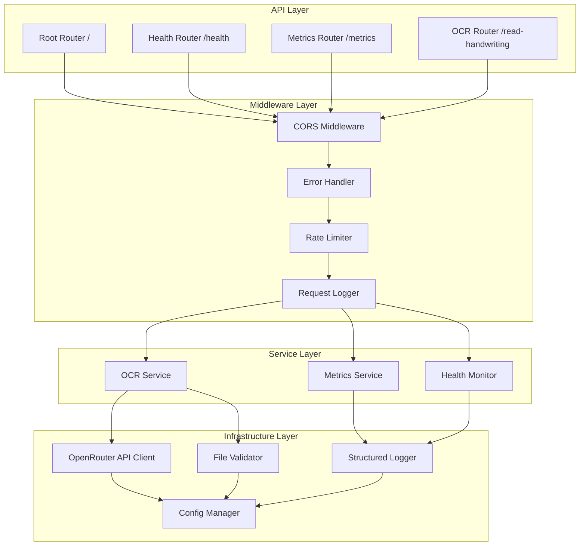

# 📝 Handwriting OCR Service

[](https://fastapi.tiangolo.com)
[](https://www.python.org)
[](LICENSE)
[](https://www.docker.com)

A modern, production-ready FastAPI backend service for handwriting OCR (Optical Character Recognition) using OpenRouter's powerful vision models. This service provides high-accuracy text extraction from handwritten images with comprehensive monitoring, error handling, and security features.

## 🌟 Key Features

### Core Functionality
- **🎯 High-Accuracy OCR**: Powered by multiple vision models via OpenRouter
- **🤖 Dynamic Model Discovery**: Automatically discovers and uses best available free models
- **🔄 Multi-Model Fallback**: Automatic fallback to alternative models for higher reliability
- **🔧 Self-Healing**: Automatically adapts to model changes and deprecations
- **⚡ Asynchronous Processing**: Non-blocking I/O for high performance
- **🔄 Concurrent Request Handling**: Process multiple requests simultaneously
- **🌍 Multi-Format Support**: JPEG, PNG, and WebP image formats
- **🗣️ Multi-Language Support**: Supports Turkish, English, and many other languages with language hints

### Production-Ready Features
- **🛡️ Rate Limiting**: IP-based rate limiting to prevent abuse
- **📊 Comprehensive Monitoring**: Built-in metrics and health checks
- **🔍 Structured Logging**: JSON-formatted logs with rotation
- **⚠️ Advanced Error Handling**: Detailed error responses with proper HTTP status codes
- **🔒 Security**: Input validation, file size limits, CORS configuration
- **📚 Interactive API Documentation**: Auto-generated Swagger UI and ReDoc

### DevOps & Deployment
- **🐳 Docker Support**: Multi-stage Dockerfile with health checks
- **🔧 Environment-Based Configuration**: Easy configuration via environment variables
- **✅ Comprehensive Testing**: Unit and integration tests
- **📈 Performance Metrics**: Real-time performance tracking and reporting
- **🔄 Graceful Shutdown**: Proper resource cleanup on termination

## 🏗️ Architecture

The service follows a clean, layered architecture with separation of concerns:



### Component Overview

- **Routers**: Handle HTTP requests and responses
- **Middleware**: Cross-cutting concerns (CORS, errors, rate limiting, logging)
- **Services**: Business logic and external API integration
- **Infrastructure**: Utilities, validation, configuration, and logging

## 📦 Installation

### Prerequisites

- **Python 3.8+** (Python 3.10+ recommended)
- **OpenRouter API Key** (Get one free at [openrouter.ai](https://openrouter.ai/keys))
- **Docker** (optional, for containerized deployment)

### Local Development Setup

1. **Clone the repository:**
   ```bash
   git clone https://github.com/yourusername/handwriting-ocr.git
   cd handwriting-ocr
   ```

2. **Create and activate a virtual environment:**
   ```bash
   # On Linux/macOS
   python -m venv venv
   source venv/bin/activate
   
   # On Windows
   python -m venv venv
   venv\Scripts\activate
   ```

3. **Install dependencies:**
   ```bash
   pip install -r requirements.txt
   ```

4. **Configure environment variables:**
   ```bash
   cp .env.example .env
   # Edit .env and add your OPENROUTER_API_KEY
   ```

5. **Run the application:**
   ```bash
   # Development mode (with auto-reload)
   uvicorn app.main:app --reload
   
   # Production mode
   uvicorn app.main:app --host 0.0.0.0 --port 8000
   ```

6. **Access the API:**
   - API Root: http://localhost:8000/
   - Interactive Docs: http://localhost:8000/docs
   - Alternative Docs: http://localhost:8000/redoc
   - Health Check: http://localhost:8000/health
   - Metrics: http://localhost:8000/metrics

### Docker Setup

Docker provides an isolated, reproducible environment for running the service.

#### Using Docker Compose (Recommended)

1. **Configure environment:**
   ```bash
   cp .env.example .env
   # Edit .env and add your OPENROUTER_API_KEY
   ```

2. **Start the service:**
   ```bash
   docker-compose up -d
   ```

3. **View logs:**
   ```bash
   docker-compose logs -f
   ```

4. **Stop the service:**
   ```bash
   docker-compose down
   ```

#### Using Docker Directly

1. **Build the image:**
   ```bash
   docker build -t handwriting-ocr-api:latest .
   ```

2. **Run the container:**
   ```bash
   docker run -d \
     --name handwriting-ocr-api \
     -p 8000:8000 \
     -e OPENROUTER_API_KEY=your_api_key_here \
     handwriting-ocr-api:latest
   ```

3. **Check health:**
   ```bash
   docker inspect --format='{{.State.Health.Status}}' handwriting-ocr-api
   ```

## ⚙️ Configuration

### Environment Variables

All configuration is done via environment variables. See [.env.example](.env.example) for a complete list.

#### Required Variables

| Variable | Description | Example |
|----------|-------------|---------|
| `OPENROUTER_API_KEY` | Your OpenRouter API key | `sk-or-v1-...` |

#### Optional Variables (with defaults)

| Variable | Default | Description |
|----------|---------|-------------|
| `APP_NAME` | `Handwriting OCR Service` | Application name |
| `APP_VERSION` | `2.0.0` | Application version |
| `ENVIRONMENT` | `development` | Environment (development/production) |
| `OPENROUTER_BASE_URL` | `https://openrouter.ai/api/v1` | OpenRouter API base URL |
| `OCR_MODEL_ID` | `qwen/qwen2.5-vl-72b-instruct:free` | OCR model to use (deprecated) |
| `OCR_MODEL_FALLBACK_LIST` | See below | Comma-separated list of models for fallback |
| `RATE_LIMIT_PER_MINUTE` | `10` | Max requests per minute per IP |
| `RATE_LIMIT_WINDOW` | `60` | Rate limit window in seconds |
| `MAX_FILE_SIZE_MB` | `10` | Maximum file size in MB |
| `OCR_TIMEOUT_SECONDS` | `30` | OCR processing timeout |
| `EXTERNAL_API_TIMEOUT` | `30` | External API call timeout |
| `CORS_ORIGINS` | `["*"]` | Allowed CORS origins |
| `LOG_LEVEL` | `INFO` | Logging level (DEBUG/INFO/WARNING/ERROR/CRITICAL) |
| `LOG_FILE` | `logs/app.log` | Log file path |

**Dynamic Model Discovery:**
The service automatically discovers and prioritizes free vision models from OpenRouter. Current top models include:
- `nvidia/nemotron-nano-12b-v2-vl:free` (Vision-capable)
- `google/gemma-3n-e2b-it:free`
- `google/gemma-3n-e4b-it:free`

Models are automatically refreshed when errors occur or on startup.

### Configuration Example

```bash
# .env file
OPENROUTER_API_KEY=sk-or-v1-your-key-here
ENVIRONMENT=production
RATE_LIMIT_PER_MINUTE=20
MAX_FILE_SIZE_MB=15
LOG_LEVEL=WARNING
CORS_ORIGINS=["https://yourdomain.com"]
```

## 🚀 API Usage

### Quick Start Examples

#### Using cURL

**1. Check API Health:**
```bash
curl http://localhost:8000/health
```

**2. Process Handwriting Image:**
```bash
# Without language hint
curl -X POST http://localhost:8000/read-handwriting \
  -F "file=@handwriting.jpg"

# With language hint (recommended for better accuracy)
curl -X POST http://localhost:8000/read-handwriting \
  -F "file=@handwriting.jpg" \
  -F "language=Turkish"
```

**3. Get Performance Metrics:**
```bash
curl http://localhost:8000/metrics
```

#### Using Python

**Basic OCR Request:**
```python
import requests

# Process an image with language hint
with open('handwriting.jpg', 'rb') as f:
    files = {'file': f}
    data = {'language': 'Turkish'}  # Optional but recommended
    response = requests.post(
        'http://localhost:8000/read-handwriting',
        files=files,
        data=data
    )

result = response.json()
print(f"Extracted text: {result['text']}")
print(f"Model used: {result['model_used']}")
print(f"Confidence: {result['confidence']:.2%}")
print(f"Processing time: {result['processing_time']:.2f}s")
```

**Async Python Client:**
```python
import httpx
import asyncio

async def process_handwriting(image_path: str):
    async with httpx.AsyncClient() as client:
        with open(image_path, 'rb') as f:
            files = {'file': f}
            response = await client.post(
                'http://localhost:8000/read-handwriting',
                files=files,
                timeout=60.0
            )
        return response.json()

# Run async
result = asyncio.run(process_handwriting('handwriting.jpg'))
print(result)
```

**Batch Processing:**
```python
import requests
from pathlib import Path
from concurrent.futures import ThreadPoolExecutor

def process_image(image_path):
    with open(image_path, 'rb') as f:
        files = {'file': f}
        response = requests.post(
            'http://localhost:8000/read-handwriting',
            files=files
        )
    return response.json()

# Process multiple images concurrently
image_paths = list(Path('images').glob('*.jpg'))
with ThreadPoolExecutor(max_workers=5) as executor:
    results = list(executor.map(process_image, image_paths))

for path, result in zip(image_paths, results):
    print(f"{path.name}: {result['text'][:50]}...")
```

### API Response Examples

**Successful OCR Response:**
```json
{
  "text": "Bu el yazısı metninden çıkarılan içeriktir.",
  "confidence": 0.95,
  "processing_time": 9.84,
  "model_used": "nvidia/nemotron-nano-12b-v2-vl:free",
  "language": "Turkish"
}
```

**Response Fields:**
- `text`: Extracted text from the image
- `confidence`: Model confidence score (0.0 to 1.0)
- `processing_time`: Processing duration in seconds
- `model_used`: The model that successfully processed the image (useful for monitoring fallback)
- `language`: Language hint provided in the request (optional)

### 🔄 Multi-Model Fallback Mechanism

The service implements an intelligent fallback system with **dynamic model discovery** that automatically adapts to OpenRouter's changing model landscape.

**Dynamic Model Discovery:**

- 🤖 **Automatic Discovery**: Fetches available models from OpenRouter on startup
- 🎯 **Smart Filtering**: Only uses free vision-capable models
- 📊 **Intelligent Prioritization**: Ranks models by quality and reliability
- 🔄 **Self-Healing**: Automatically refreshes on 404 errors
- ⚡ **Zero Configuration**: Works out of the box, no manual updates needed

**How it works:**

1. **Startup**: Automatically discovers all free vision models from OpenRouter
2. **Prioritization**: Ranks models by family (Gemini > Qwen > Llama) and characteristics
3. **Automatic Fallback**: If primary model fails, tries next best model
4. **404 Handling**: If a model returns 404, refreshes the model list and tries new models
5. **Transparent**: Response shows which model succeeded

**Benefits:**

- ✅ **No More 404 Errors**: Automatically adapts when models are renamed or deprecated
- ✅ **Always Up-to-Date**: Discovers new models automatically
- ✅ **Higher Availability**: Service continues working even if models change
- ✅ **Zero Maintenance**: No need to manually update model lists
- ✅ **Full Visibility**: Response shows which model was used

**Example with Turkish Language:**

```python
import requests

# Turkish handwriting example
response = requests.post(
    'http://localhost:8000/read-handwriting',
    files={'file': open('turkish_handwriting.jpg', 'rb')},
    data={'language': 'Turkish'}
)

data = response.json()
print(f"Metin: {data['text']}")
print(f"Kullanılan model: {data['model_used']}")
print(f"Güven skoru: {data['confidence']:.2%}")
print(f"İşlem süresi: {data['processing_time']:.2f}s")
```

**Monitoring:**

The service logs show discovered models on startup:
```json
{"event": "Models fetched and cached successfully", "count": 10, "models": ["nvidia/nemotron-nano-12b-v2-vl:free", ...]}
```

You can also check the `/metrics` endpoint to see which models are being used most frequently.


**Health Check Response:**
```json
{
  "status": "healthy",
  "checks": {
    "api": {
      "status": "healthy",
      "message": "API is running"
    },
    "external_api": {
      "status": "healthy",
      "message": "External API is reachable"
    },
    "system": {
      "status": "healthy",
      "cpu_percent": 15.2,
      "memory_percent": 45.8,
      "memory_available_mb": 2048.5
    }
  },
  "timestamp": "2024-01-15T10:30:00.000000"
}
```

**Metrics Response:**
```json
{
  "uptime_seconds": 3600.5,
  "endpoints": {
    "/read-handwriting": {
      "total_requests": 150,
      "successful_requests": 145,
      "failed_requests": 5,
      "average_response_time": 2.45,
      "error_rate": 0.033
    },
    "/health": {
      "total_requests": 500,
      "successful_requests": 500,
      "failed_requests": 0,
      "average_response_time": 0.05,
      "error_rate": 0.0
    }
  }
}
```

**Error Response:**
```json
{
  "error": "Validation Error",
  "detail": "File too large. Maximum size: 10MB",
  "timestamp": "2024-01-15T10:30:00.000000",
  "path": "/read-handwriting"
}
```

### API Endpoints

| Endpoint | Method | Description | Rate Limit |
|----------|--------|-------------|------------|
| `/` | GET | API information and available endpoints | Default |
| `/health` | GET | Comprehensive health check | 120/min |
| `/metrics` | GET | Performance metrics and statistics | 60/min |
| `/read-handwriting` | POST | Process handwriting image | 10/min |
| `/docs` | GET | Interactive Swagger UI documentation | Default |
| `/redoc` | GET | Alternative ReDoc documentation | Default |
| `/openapi.json` | GET | OpenAPI 3.0 schema | Default |

## 🧪 Testing

### Running Tests

The project includes comprehensive test coverage with unit and integration tests.

**Run all tests:**
```bash
pytest
```

**Run with verbose output:**
```bash
pytest -v
```

**Run specific test categories:**
```bash
# Unit tests only
pytest app/tests/unit/ -v

# Integration tests only
pytest app/tests/integration/ -v
```

**Run with coverage report:**
```bash
pytest --cov=app --cov-report=term
```

### Test Structure

```
app/tests/
├── conftest.py              # Shared fixtures
├── unit/                    # Unit tests
│   ├── test_config.py
│   ├── test_validators.py
│   ├── test_ocr_service.py
│   ├── test_metrics_service.py
│   ├── test_health_service.py
│   └── ...
└── integration/             # Integration tests
    ├── test_main_app.py
    ├── test_health_router.py
    ├── test_metrics_router.py
    ├── test_ocr_router.py
    └── ...
```

### Writing New Tests

**Unit Test Example:**
```python
import pytest
from fastapi.testclient import TestClient
from app.main import create_app

@pytest.fixture
def client():
    app = create_app()
    return TestClient(app)

def test_health_endpoint(client):
    response = client.get("/health")
    assert response.status_code == 200
    data = response.json()
    assert "status" in data
    assert "checks" in data
```

### Coverage Goals

- **Minimum 80% code coverage** across the entire codebase
- **100% coverage** for critical paths (OCR processing, validation, error handling)
- All API endpoints must have integration tests

## 🔧 Troubleshooting

### Common Issues

#### 1. Application Won't Start

**Symptom:** Error on startup or immediate crash

**Solutions:**
- Verify `OPENROUTER_API_KEY` is set in `.env` file
- Check all dependencies are installed: `pip install -r requirements.txt`
- Ensure Python version is 3.8 or higher: `python --version`
- Check logs for detailed error messages: `tail -f logs/app.log`

#### 2. Rate Limit Errors (HTTP 429)

**Symptom:** `Too Many Requests` error

**Solutions:**
- Wait 60 seconds for rate limit window to reset
- Increase `RATE_LIMIT_PER_MINUTE` in `.env` file
- Use different IP address or implement request queuing
- Check if multiple clients share the same IP

#### 3. File Upload Errors (HTTP 400)

**Symptom:** `Invalid file` or `File too large` errors

**Solutions:**
- Verify file size is under `MAX_FILE_SIZE_MB` (default 10MB)
- Ensure file format is JPEG, PNG, or WebP
- Check file is not corrupted: `file your-image.jpg`
- Try compressing the image before upload

#### 4. OCR Timeout Errors (HTTP 504)

**Symptom:** `Gateway Timeout` error

**Solutions:**
- Increase `OCR_TIMEOUT_SECONDS` in `.env` file (default 30s)
- Check network connectivity to OpenRouter API
- Try with a smaller or simpler image
- Verify OpenRouter API status at [status.openrouter.ai](https://status.openrouter.ai)

#### 5. External API Errors (HTTP 502)

**Symptom:** `Bad Gateway` error

**Solutions:**
- Verify `OPENROUTER_API_KEY` is valid and active
- Check OpenRouter API status
- Ensure you have sufficient credits/quota
- Review OpenRouter API logs at [openrouter.ai/activity](https://openrouter.ai/activity)

#### 6. CORS Errors

**Symptom:** Browser blocks requests with CORS error

**Solutions:**
- Add your frontend domain to `CORS_ORIGINS` in `.env`
- Format: `CORS_ORIGINS=["http://localhost:3000","https://yourdomain.com"]`
- Use `"*"` for development only (not recommended for production)
- Ensure preflight OPTIONS requests are not blocked

#### 7. Docker Container Health Check Failing

**Symptom:** Container marked as unhealthy

**Solutions:**
- Check container logs: `docker logs handwriting-ocr-api`
- Verify health endpoint manually: `curl http://localhost:8000/health`
- Ensure port 8000 is not blocked by firewall
- Check if OpenRouter API is reachable from container

### Performance Notes

#### Benchmarks

Performance metrics from testing on a standard system:

| Metric | Value | Notes |
|--------|-------|-------|
| Health Check Response | < 100ms | Includes system resource checks |
| Metrics Endpoint Response | < 200ms | Includes all endpoint statistics |
| OCR Processing (Average) | 5-15 seconds | Depends on image size, complexity, and model |
| OCR Processing (Max) | 30 seconds | Configurable timeout |
| Concurrent Requests | 10+ req/min | Rate limited per IP |
| Memory Usage (Idle) | ~150MB | Base application footprint |
| Memory Usage (Peak) | ~500MB | During heavy OCR processing |
| Startup Time | < 3 seconds | Including model discovery |

**Note:** Processing time varies by model. Nvidia Nemotron models typically take 8-12 seconds, while Google Gemma models may be faster.

#### Optimization Tips

1. **Reduce Image Size**: Compress images before upload to reduce processing time
2. **Use Appropriate Timeout**: Adjust `OCR_TIMEOUT_SECONDS` based on your needs
3. **Enable Caching**: Consider implementing Redis caching for repeated requests
4. **Horizontal Scaling**: Run multiple instances behind a load balancer
5. **Resource Limits**: Set appropriate Docker resource limits for predictable performance

### Limitations

#### Current Limitations

1. **Single Model**: Currently supports only one OCR model at a time
2. **No Batch Processing**: Each request processes one image
3. **No Result Storage**: Results are not persisted (stateless)
4. **No Authentication**: No built-in user authentication (add via reverse proxy)
5. **No Webhooks**: Synchronous processing only (no async callbacks)
6. **Memory Bound**: Large images are loaded entirely into memory

#### Planned Improvements

- Multi-model support with model selection
- Batch processing for multiple images
- Optional result storage with database integration
- API key authentication
- Webhook support for async processing
- Streaming response for large results
- Redis caching layer
- Prometheus metrics export

### Getting Help

If you encounter issues not covered here:

1. **Check the logs**: Run `docker logs -f handwriting-ocr-api` if using Docker
2. **Review API documentation**: Visit http://localhost:8000/docs
3. **Check health status**: Visit http://localhost:8000/health
4. **Review metrics**: Visit http://localhost:8000/metrics
5. **Search existing issues**: Check GitHub issues for similar problems
6. **Open a new issue**: Provide logs, configuration, and steps to reproduce

## 🤝 Contributing

We welcome contributions! Please follow these guidelines:

### Code Style Requirements

- **PEP 8**: Follow Python PEP 8 style guidelines
- **Type Hints**: Use type hints for all function parameters and return values
- **Docstrings**: Include docstrings for all public functions and classes
- **Async/Await**: Use async/await for I/O operations
- **Error Handling**: Use proper exception handling with descriptive messages

### Code Formatting

```bash
# Format code with black
black app/

# Sort imports with isort
isort app/

# Check types with mypy
mypy app/

# Lint with flake8
flake8 app/
```

### Contribution Workflow

1. **Fork the repository**
2. **Create a feature branch**: `git checkout -b feature/your-feature-name`
3. **Make your changes** following the code style requirements
4. **Write tests** for new functionality
5. **Run tests**: `pytest` (ensure all tests pass)
6. **Check coverage**: `pytest --cov=app` (maintain 80%+ coverage)
7. **Commit your changes**: `git commit -m "Add: your feature description"`
8. **Push to your fork**: `git push origin feature/your-feature-name`
9. **Open a Pull Request** with a clear description

### Commit Message Format

```
Type: Brief description (50 chars or less)

More detailed explanation if needed (wrap at 72 chars).
Include motivation for the change and contrast with previous behavior.

- Bullet points are okay
- Use present tense: "Add feature" not "Added feature"
- Reference issues: "Fixes #123" or "Relates to #456"
```

**Types**: `Add`, `Fix`, `Update`, `Remove`, `Refactor`, `Docs`, `Test`, `Style`

### Pull Request Guidelines

- **Clear Title**: Describe what the PR does
- **Description**: Explain the changes and why they're needed
- **Tests**: Include tests for new functionality
- **Documentation**: Update README or docs if needed
- **No Breaking Changes**: Avoid breaking existing functionality
- **Small PRs**: Keep PRs focused and reasonably sized

### Development Setup

```bash
# Clone your fork
git clone https://github.com/yourusername/handwriting-ocr.git
cd handwriting-ocr

# Create virtual environment
python -m venv venv
source venv/bin/activate  # or venv\Scripts\activate on Windows

# Install dependencies including dev tools
pip install -r requirements.txt
pip install black isort mypy flake8

# Run tests
pytest

# Start development server
uvicorn app.main:app --reload
```

### Areas for Contribution

- 🐛 **Bug Fixes**: Fix reported issues
- ✨ **New Features**: Add new functionality (discuss first in issues)
- 📚 **Documentation**: Improve docs, add examples
- 🧪 **Tests**: Increase test coverage
- 🎨 **UI/UX**: Improve API documentation
- ⚡ **Performance**: Optimize code for better performance
- 🔒 **Security**: Identify and fix security issues

## 📄 License

This project is licensed under the **MIT License** - see the [LICENSE](LICENSE) file for details.

### MIT License Summary

- ✅ **Commercial use**: You can use this software commercially
- ✅ **Modification**: You can modify the software
- ✅ **Distribution**: You can distribute the software
- ✅ **Private use**: You can use the software privately
- ⚠️ **Liability**: The software is provided "as is", without warranty
- ⚠️ **License and copyright notice**: Include the license and copyright notice

### Third-Party Licenses

This project uses the following open-source libraries:

- **FastAPI**: MIT License
- **Uvicorn**: BSD License
- **Pydantic**: MIT License
- **httpx**: BSD License
- **structlog**: MIT License
- **pytest**: MIT License

See individual package licenses for more details.

## 🙏 Acknowledgments

- **OpenRouter**: For providing access to powerful vision models
- **Qwen Team**: For the excellent Qwen 2.5-VL model
- **FastAPI**: For the amazing web framework
- **Python Community**: For the excellent ecosystem of libraries

## 📞 Support & Contact

- **API Documentation**: http://localhost:8000/docs (interactive Swagger UI)
- **Alternative Docs**: http://localhost:8000/redoc (ReDoc format)
- **Health Check**: http://localhost:8000/health
- **Metrics**: http://localhost:8000/metrics

## 🗺️ Roadmap

### Version 2.1 (Next Release)
- [ ] API key authentication
- [ ] Redis caching layer
- [ ] Batch processing support
- [ ] Prometheus metrics export

### Version 2.2
- [ ] Multi-model support
- [ ] Database integration for result storage
- [ ] Webhook support for async processing
- [ ] Advanced image preprocessing

### Version 3.0
- [ ] User management system
- [ ] Usage quotas and billing
- [ ] Advanced analytics dashboard
- [ ] Multi-language UI

---

**Made with ❤️ using FastAPI and OpenRouter**

*For questions, issues, or contributions, please visit our [GitHub repository](https://github.com/yourusername/handwriting-ocr).*
